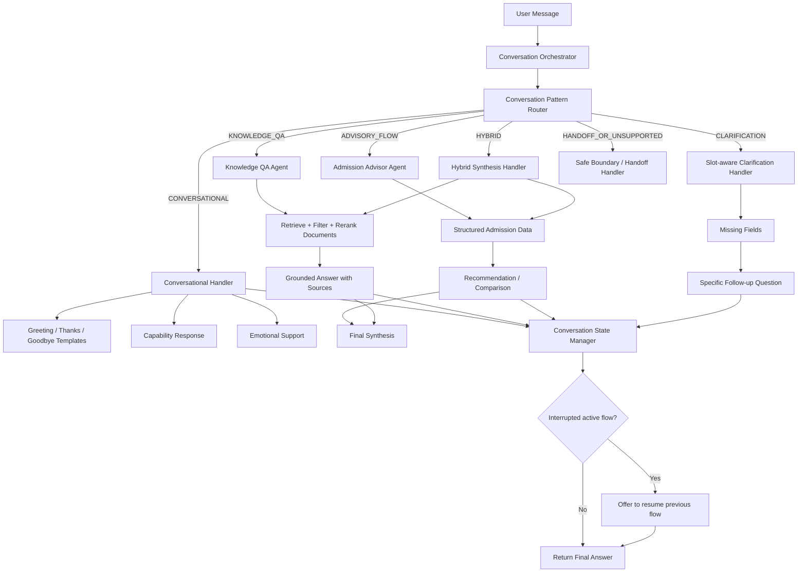
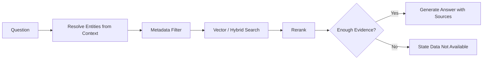
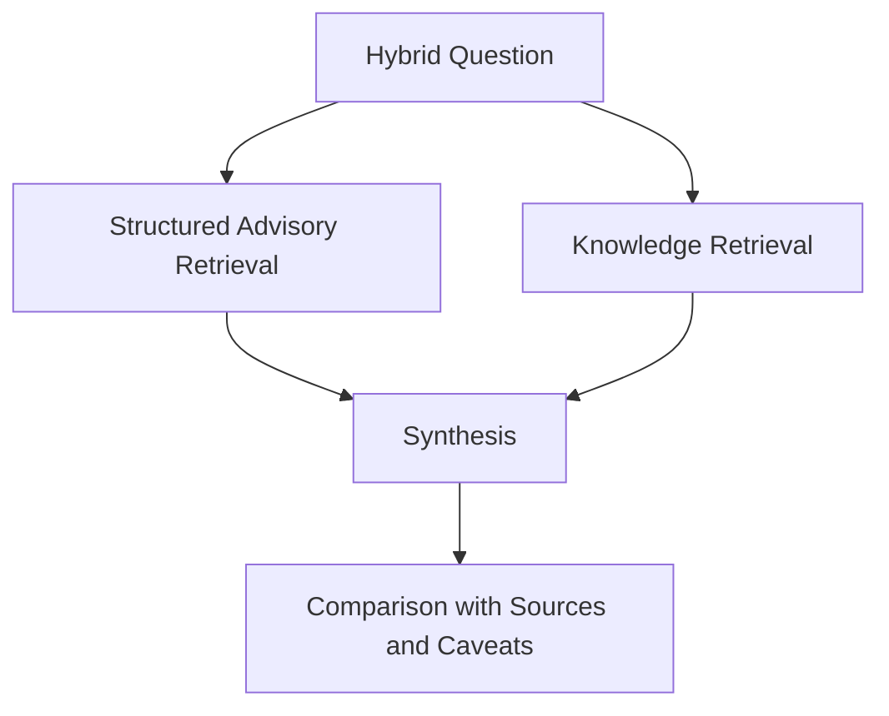

# Kiến trúc hội thoại linh hoạt cho Admission Advisory Agent

**Trạng thái:** Proposed Architecture  
**Phạm vi:** Admission Advisory Assistant / University Admission Advisory Agent  
**Mục tiêu:** Giải quyết việc agent trả lời cứng nhắc với hội thoại thông thường và xử lý sai các câu hỏi thông tin bên lề như học phí, chương trình học, học bổng hoặc chính sách trường.

---

## 1. Bối cảnh và vấn đề hiện tại

Hệ thống hiện tại được xây dựng chủ yếu cho **luồng tư vấn tuyển sinh có cấu trúc**, ví dụ:

- Tư vấn chọn trường hoặc chọn ngành.
- Hỏi điểm, tổ hợp xét tuyển, phương thức xét tuyển.
- So sánh khả năng trúng tuyển hoặc xử lý dữ liệu tuyển sinh có xung đột.

Tuy nhiên, trong hội thoại thật, người dùng không chỉ đi theo một luồng cố định. Họ có thể:

- Chào hỏi: “Xin chào”, “Hi”.
- Hỏi khả năng của trợ lý: “Bạn giúp được gì?”.
- Hỏi thông tin trường: “Học phí UET thế nào?”, “Chương trình học ngành CNTT gồm gì?”.
- Tạm rẽ khỏi flow: đang tư vấn ngành nhưng hỏi thêm về học phí.
- Thể hiện cảm xúc: “Mình lo không đỗ đại học”.

Hiện tại, các câu như “xin chào” hoặc “bạn giúp được gì?” lại nhận phản hồi dạng:

> “Bạn có thể nói rõ hơn câu hỏi của mình không? Mình muốn hiểu đúng để hỗ trợ tốt hơn.”

Điều này tạo cảm giác agent máy móc, không hiểu hội thoại tự nhiên và khiến toàn bộ trải nghiệm bị giới hạn trong một luồng tư vấn cứng.

---

## 2. Root cause đã xác định

> Phần này dựa trên kết quả trace luồng xử lý hiện tại đã được cung cấp trong quá trình phân tích; cần đối chiếu lại với code chính thức trước khi triển khai.

Luồng hiện tại:

```text
handle_user_message
      ↓
intent_router.classify()
      ↓
route vào một trong các nhánh hiện có
      ↓
conversation handler trả câu trả lời
```

Taxonomy hiện tại chỉ có các route:

```text
ADVISORY_FLOW
KNOWLEDGE_QA
HYBRID
CLARIFICATION
OUT_OF_SCOPE
```

Có hai nguyên nhân chính:

### 2.1. Thiếu route cho hội thoại thông thường

Những câu như:

```text
"Xin chào"
"Bạn giúp được gì?"
"Cảm ơn nhé"
"Bạn là ai?"
```

không phải là:

- nhu cầu tư vấn lựa chọn;
- câu hỏi knowledge;
- câu hỏi hybrid;
- câu hỏi thiếu entity cần làm rõ;
- hay yêu cầu thật sự ngoài phạm vi.

Do không có route phù hợp, classifier buộc phải chọn nhãn gần nhất, thường là `CLARIFICATION`.

### 2.2. Handler clarification đang bị dùng như generic fallback

`CLARIFICATION` hiện trả về một thông điệp tĩnh chung cho nhiều trường hợp khác nhau.

Đây là cách dùng không đúng về mặt thiết kế:

```text
CLARIFICATION ≠ mọi câu mà router không biết xử lý
CLARIFICATION = nhu cầu hợp lệ nhưng thiếu thông tin bắt buộc để xử lý
```

Ví dụ đúng cho `CLARIFICATION`:

```text
User: "Học phí trường này bao nhiêu?"
Context: chưa từng nhắc trường nào
→ Hỏi lại trường cần tra cứu.
```

Ví dụ không nên đi vào `CLARIFICATION`:

```text
User: "Xin chào"
→ CONVERSATIONAL / GREETING

User: "Bạn giúp được gì?"
→ CONVERSATIONAL / CAPABILITY
```

---

## 3. Benchmark: các hệ thống tương tự xử lý vấn đề này như thế nào?

### 3.1. Rasa CALM: conversation patterns nằm ngoài business flow

Rasa mô tả rằng hội thoại thật hiếm khi tuyến tính: người dùng có thể đổi chủ đề, hỏi thêm hoặc sửa thông tin khi đang ở giữa một flow. Vì vậy, CALM có các **conversation patterns** để xử lý các tương tác lệch khỏi “happy path” mà không làm biến dạng business flow chính.

Các pattern có liên quan trực tiếp tới bài toán này gồm:

- Chitchat.
- Knowledge search.
- Clarification.
- Continue interrupted flow.
- Cannot handle.
- Human handoff.

**Bài học áp dụng:** không nên ép greeting, knowledge question hoặc interruption vào flow tư vấn tuyển sinh; nên có một lớp xử lý pattern riêng trước khi gọi domain handler.

### 3.2. Microsoft Copilot Studio: fallback không chỉ là câu xin nói rõ hơn

Copilot Studio kích hoạt fallback khi agent không hiểu utterance hoặc không đủ confidence để kích hoạt topic. Tuy nhiên, fallback có thể:

- Gọi external question answering system.
- Dùng nguồn chitchat với tone phù hợp.
- Gọi generative AI model trong phạm vi kiểm soát.
- Thu thập các utterance hay rơi vào fallback để cải thiện topic và routing.

**Bài học áp dụng:** fallback nên là cơ chế phân luồng và cải tiến liên tục, không nên chỉ là một chuỗi hard-code.

### 3.3. Google Dialogflow CX: welcome intent riêng cho greeting

Dialogflow CX tạo sẵn `Default Welcome Intent`, với các training phrase như “Hi” hoặc “Hello”, để xử lý điểm bắt đầu hội thoại. Greeting không bị coi là no-match hoặc câu cần clarification.

**Bài học áp dụng:** greeting và capability discovery là hành vi sản phẩm cơ bản, cần route riêng ngay từ đầu.

### 3.4. Element451 Bolt: Knowledge Hub cho admissions, tuition và programs

Element451, một nền tảng AI/CRM cho higher education, mô tả Knowledge Hub là kho tri thức curated phục vụ Bolt Agents for Students. Nguồn public được dùng cho các nhóm nội dung student-facing như:

- Admissions.
- Tuition.
- Programs.
- Policies.

Họ cũng nhấn mạnh chất lượng câu trả lời phụ thuộc vào cách tổ chức và quản trị nguồn tri thức.

**Bài học áp dụng:** dữ liệu học phí và chương trình đào tạo không nên bị nhét vào advisory flow; cần một knowledge corpus có metadata rõ ràng để trả lời bằng RAG.

### 3.5. Mainstay / AdmitHub: hỗ trợ sinh viên xuyên suốt, giải phóng advisor khỏi câu hỏi cơ bản

Mainstay mô tả AI success coaching cho sinh viên và khả năng giúp nhân sự tập trung vào các tương tác cần mức độ hỗ trợ cao hơn. Các mô tả công khai cho thấy mô hình student support thực tế thường kết hợp trả lời câu hỏi, hướng dẫn quy trình và chuyển sự chú ý của con người vào vấn đề quan trọng.

**Bài học áp dụng:** agent nên giải quyết được câu hỏi phổ biến một cách tự nhiên, nhưng vẫn có ranh giới và đường chuyển tiếp khi câu hỏi phức tạp hoặc nhạy cảm.

---

## 4. Nguyên tắc kiến trúc đề xuất

### Nguyên tắc 1: Tách conversation pattern khỏi domain capability

Agent cần phân biệt:

- Người dùng đang giao tiếp xã hội.
- Người dùng đang hỏi thông tin.
- Người dùng đang cần tư vấn ra quyết định.
- Người dùng đang thiếu thông tin để tiếp tục.
- Người dùng đang hỏi ngoài phạm vi.

### Nguyên tắc 2: `CLARIFICATION` không phải generic fallback

Chỉ dùng `CLARIFICATION` khi đã hiểu mục tiêu của user nhưng thiếu field cần thiết, ví dụ thiếu trường, ngành, năm tuyển sinh hoặc tổ hợp.

### Nguyên tắc 3: Knowledge answer phải grounded

Các câu như học phí, chương trình học, chính sách, học bổng hoặc ký túc xá phải đi qua retrieval trên tài liệu đã ingest và trả lời kèm nguồn. Không đủ bằng chứng thì nói rõ chưa có dữ liệu.

### Nguyên tắc 4: Không làm mất active flow khi user rẽ ngang

Nếu đang ở giữa flow tư vấn, agent có thể trả lời câu hỏi bên lề hoặc xã giao, sau đó đề nghị quay lại luồng trước đó một cách tự nhiên.

### Nguyên tắc 5: Không gọi LLM cho mọi câu đơn giản

Greeting, thanks và goodbye có thể dùng template đa biến thể. Capability, emotional support và knowledge synthesis có thể dùng LLM với prompt và evidence giới hạn.

---

## 5. Kiến trúc tổng thể khuyên dùng



---

## 6. Route taxonomy mới

### 6.1. Top-level route

```ts
type Route =
  | "CONVERSATIONAL"
  | "KNOWLEDGE_QA"
  | "ADVISORY_FLOW"
  | "HYBRID"
  | "CLARIFICATION"
  | "HANDOFF_OR_UNSUPPORTED";
```

### 6.2. Conversational subtype

```ts
type ConversationalSubtype =
  | "GREETING"
  | "CAPABILITY"
  | "THANKS"
  | "GOODBYE"
  | "IDENTITY"
  | "EMOTIONAL_SUPPORT";
```

### 6.3. Knowledge topics

```ts
type KnowledgeTopic =
  | "TUITION"
  | "CURRICULUM"
  | "SCHOLARSHIP"
  | "DORMITORY"
  | "ADMISSION_POLICY"
  | "PROGRAM_OVERVIEW"
  | "CAREER_OUTCOME"
  | "ENGLISH_REQUIREMENT";
```

### 6.4. Routing decision schema

```ts
interface RoutingDecision {
  route: Route;
  subtype?: ConversationalSubtype;
  topic?: KnowledgeTopic;

  entities: {
    school?: string;
    program?: string;
    admissionYear?: number;
    subjectCombination?: string;
  };

  missingFields: string[];

  interruptedFlow?: "ADMISSION_ADVISORY";
  suggestResumeFlow: boolean;

  confidence: number;
  reason: string;
}
```

---

## 7. Routing rules theo nhóm câu hỏi

| User input | Route / Subtype | Handler |
|---|---|---|
| “Xin chào” | `CONVERSATIONAL / GREETING` | Template tự nhiên |
| “Bạn giúp được gì?” | `CONVERSATIONAL / CAPABILITY` | Capability response có kiểm soát |
| “Cảm ơn nhé” | `CONVERSATIONAL / THANKS` | Template ngắn |
| “Tạm biệt” | `CONVERSATIONAL / GOODBYE` | Template ngắn |
| “Bạn là ai?” | `CONVERSATIONAL / IDENTITY` | Response mô tả vai trò |
| “Mình lo không đỗ UET” | `CONVERSATIONAL / EMOTIONAL_SUPPORT` | Đồng cảm + đề xuất hỗ trợ cụ thể |
| “Học phí UET bao nhiêu?” | `KNOWLEDGE_QA / TUITION` | RAG trên tài liệu học phí |
| “Chương trình học CNTT UET gồm gì?” | `KNOWLEDGE_QA / CURRICULUM` | RAG trên curriculum |
| “Với 25 điểm A00 nên chọn ngành nào?” | `ADVISORY_FLOW` | Structured advisory |
| “Nên chọn UET hay NEU xét cả học phí và khả năng đỗ?” | `HYBRID` | Structured data + RAG synthesis |
| “Học phí trường này bao nhiêu?” khi chưa có school context | `CLARIFICATION` | Hỏi trường cụ thể |
| “Viết code Python giúp tôi” | `HANDOFF_OR_UNSUPPORTED` | Boundary response |

---

## 8. Thiết kế handler

## 8.1. Conversational Handler

### Greeting, Thanks, Goodbye

Không cần gọi LLM cho các tương tác ngắn và ổn định. Dùng template có nhiều biến thể để câu trả lời bớt lặp lại.

```python
GREETING_RESPONSES = [
    "Chào bạn! Mình có thể hỗ trợ bạn tìm hiểu trường, ngành học hoặc thông tin tuyển sinh.",
    "Xin chào! Bạn đang muốn tìm hiểu trường, ngành hay phương thức xét tuyển nào?",
    "Chào bạn! Mình sẵn sàng giúp bạn tra cứu thông tin và cân nhắc lựa chọn phù hợp."
]
```

### Capability

Câu trả lời phải dựa trên capability thực tế đã triển khai, không quảng bá chức năng chưa có.

Ví dụ khi đã có advisory + knowledge QA:

```text
Mình có thể giúp bạn tìm hiểu trường và ngành học, tra cứu các thông tin như
học phí hoặc chương trình đào tạo khi hệ thống có nguồn dữ liệu, đồng thời hỗ
trợ bạn cân nhắc lựa chọn phù hợp dựa trên điểm số và nhu cầu của bạn.
Bạn muốn bắt đầu với trường hay ngành nào?
```

Ví dụ khi chưa ingest học phí/curriculum:

```text
Mình hiện có thể hỗ trợ bạn về thông tin tuyển sinh và cân nhắc lựa chọn
trường/ngành. Một số nội dung như học phí hoặc chương trình học sẽ được trả
lời khi hệ thống đã có nguồn tài liệu tương ứng.
```

### Emotional Support

Không nên chỉ coi là smalltalk. Handler cần:

1. Phản hồi đồng cảm ngắn.
2. Không bảo đảm kết quả tuyển sinh.
3. Chuyển cảm xúc thành bước hỗ trợ cụ thể.

Ví dụ:

```text
Mình hiểu cảm giác lo lắng khi phải chọn trường và chờ kết quả. Nếu bạn chia sẻ
điểm dự kiến, tổ hợp xét tuyển hoặc ngành quan tâm, mình có thể cùng bạn xem
các lựa chọn thực tế hơn.
```

---

## 8.2. Knowledge QA Agent

### Trách nhiệm

Trả lời các câu hỏi factual student-facing như:

- Học phí.
- Chương trình đào tạo.
- Học bổng.
- Ký túc xá.
- Chuẩn đầu ra.
- Chính sách tuyển sinh.
- Mô tả ngành.

### Luồng xử lý



### Metadata khuyến nghị

```ts
interface KnowledgeChunkMetadata {
  school: string;
  program?: string;
  admissionYear?: number;

  documentType:
    | "tuition_page"
    | "curriculum_pdf"
    | "admission_scheme"
    | "scholarship_policy"
    | "student_handbook"
    | "faq";

  topic:
    | "tuition"
    | "curriculum"
    | "scholarship"
    | "dormitory"
    | "admission_policy"
    | "career_outcome";

  sourceUrl: string;
  publishedAt?: string;
  effectiveYear?: number;

  span: {
    startChar: number;
    endChar: number;
  };
}
```

### Quy tắc grounded answer

```text
- Chỉ khẳng định thông tin được hỗ trợ bởi retrieved evidence.
- Nêu năm áp dụng nếu tài liệu có năm.
- Nếu tài liệu xung đột, trình bày xung đột và nguồn tương ứng.
- Nếu không retrieve đủ bằng chứng, không suy đoán.
- Khi user dùng từ "trường này", resolve từ conversation state trước;
  nếu không resolve được thì chuyển sang CLARIFICATION.
```

---

## 8.3. Admission Advisor Agent

Agent này tiếp tục chịu trách nhiệm cho tư vấn có cấu trúc:

- Điểm chuẩn.
- Tổ hợp.
- Phương thức xét tuyển.
- Chỉ tiêu/quota.
- Khuyến nghị chọn ngành hoặc trường.
- Giải thích conflict giữa các nguồn tuyển sinh.

Không nên dùng agent này để trả lời trực tiếp các câu như học phí hoặc curriculum, trừ khi đang xử lý route `HYBRID`.

---

## 8.4. Hybrid Handler

Dùng cho các câu hỏi cần cả structured advisory và unstructured knowledge.

Ví dụ:

```text
"Nên chọn UET hay NEU, xét cả khả năng đỗ và học phí?"
```

Luồng xử lý:



Kết quả nên phân tách rõ:

- Yếu tố tuyển sinh: dữ liệu có cấu trúc.
- Yếu tố chi phí/chương trình: tài liệu retrieve được.
- Điểm còn thiếu dữ liệu hoặc có nguồn xung đột.

---

## 8.5. Slot-aware Clarification Handler

Thay vì câu generic:

```text
"Bạn có thể nói rõ hơn câu hỏi của mình không?"
```

handler cần đọc `missingFields` và hỏi cụ thể.

| User request | Missing field | Follow-up thích hợp |
|---|---|---|
| “Học phí trường này thế nào?” | `school` | “Bạn đang muốn tìm hiểu học phí của trường nào?” |
| “So sánh hai ngành này giúp mình.” | `programs` | “Bạn muốn so sánh hai ngành nào?” |
| “Mình được 25 điểm thì nên chọn đâu?” | `subjectCombination` | “Bạn xét theo tổ hợp nào, ví dụ A00, A01 hay D01?” |

---

## 8.6. Safe Boundary / Handoff Handler

Dùng khi:

- Câu hỏi rõ ràng nằm ngoài phạm vi sản phẩm.
- Vấn đề có rủi ro cao hoặc cần chuyên viên hỗ trợ.
- Agent không thể trả lời dựa trên dữ liệu có sẵn.

Ví dụ response ngoài phạm vi:

```text
Mình tập trung hỗ trợ thông tin và tư vấn liên quan tới tuyển sinh đại học.
Bạn có thể hỏi mình về trường, ngành, phương thức xét tuyển hoặc học phí khi
có dữ liệu tương ứng.
```

Ví dụ với vấn đề nhạy cảm cần hỗ trợ thêm:

```text
Vấn đề này có thể cần trao đổi trực tiếp với cán bộ tư vấn hoặc bộ phận hỗ trợ
của trường để có hướng dẫn chính xác.
```

---

## 9. Conversation state và cơ chế interruption/resume

Một advisory assistant tự nhiên cần cho phép user rẽ sang câu hỏi phụ mà không làm mất flow chính.

### Ví dụ hành vi mong muốn

```text
Agent: Bạn đã có điểm dự kiến hoặc tổ hợp xét tuyển chưa?
User: À học phí UET hiện thế nào?
Agent: [Trả lời học phí dựa trên tài liệu]
Agent: Bạn có muốn tiếp tục xem khả năng xét tuyển hoặc lựa chọn ngành phù hợp không?
```

Không nên:

```text
Agent: [Trả lời học phí]
Agent: Bạn đã có điểm dự kiến hoặc tổ hợp xét tuyển chưa?
```

vì việc tự động quay lại flow ngay có thể tạo cảm giác agent không lắng nghe.

### State schema đề xuất

```ts
interface ConversationState {
  activeFlow?: {
    type: "ADMISSION_ADVISORY";
    step: string;
    pendingFields: string[];
  };

  recentEntities: {
    school?: string;
    program?: string;
    admissionYear?: number;
  };

  interruption?: {
    route: "CONVERSATIONAL" | "KNOWLEDGE_QA";
    handled: boolean;
    resumeSuggested: boolean;
  };
}
```

### Resume policy

```text
- Greeting khi chưa có active flow: trả lời greeting, không đề nghị resume.
- Thanks/goodbye khi có active flow: không ép tiếp tục flow.
- Capability/identity trong active flow: trả lời, rồi có thể nhắc nhẹ bước trước.
- Knowledge QA trong active flow: trả lời xong, hỏi user có muốn quay lại tư vấn không.
- Emotional support liên quan tuyển sinh: đồng cảm, sau đó đề xuất một bước advisory cụ thể.
```

---

## 10. Prompt cho Router

Router cần được hướng dẫn rõ để không đẩy mọi trường hợp lạ vào `CLARIFICATION`.

```text
Bạn là Conversation Pattern Router cho trợ lý tư vấn tuyển sinh.

Nhiệm vụ:
Phân loại mục đích hiện tại của user và trích xuất entity cần thiết.

Các route:
- CONVERSATIONAL: greeting, capability, thanks, goodbye, identity hoặc emotional support.
- KNOWLEDGE_QA: user hỏi thông tin factual như học phí, chương trình học, học bổng, chính sách.
- ADVISORY_FLOW: user muốn được tư vấn lựa chọn hoặc đánh giá khả năng xét tuyển.
- HYBRID: câu hỏi cần cả tư vấn có cấu trúc và thông tin factual từ tài liệu.
- CLARIFICATION: user có nhu cầu thuộc phạm vi hệ thống nhưng thiếu entity bắt buộc.
- HANDOFF_OR_UNSUPPORTED: yêu cầu rõ ràng ngoài phạm vi hoặc cần hỗ trợ khác.

Quy tắc quan trọng:
- Không ép lời chào, câu cảm ơn hoặc câu hỏi về khả năng của trợ lý vào CLARIFICATION.
- CLARIFICATION chỉ dùng khi biết user muốn gì nhưng thiếu thông tin để làm việc đó.
- Với câu hỏi dùng đại từ như “trường này”, kiểm tra conversation context trước khi kết luận thiếu entity.
- Không tự tạo entity không có trong message hoặc context.
```

### Few-shot examples

```text
User: Xin chào
→ {"route":"CONVERSATIONAL","subtype":"GREETING"}

User: Bạn có thể giúp mình gì?
→ {"route":"CONVERSATIONAL","subtype":"CAPABILITY"}

User: Cảm ơn nhé
→ {"route":"CONVERSATIONAL","subtype":"THANKS"}

User: Mình lo không đủ điểm đỗ đại học
→ {"route":"CONVERSATIONAL","subtype":"EMOTIONAL_SUPPORT","suggestResumeFlow":true}

User: Học phí UET năm nay bao nhiêu?
→ {"route":"KNOWLEDGE_QA","topic":"TUITION","entities":{"school":"VNU-UET"}}

User: Học phí trường này bao nhiêu?
Context: Không có school đã nhắc trước đó
→ {"route":"CLARIFICATION","topic":"TUITION","missingFields":["school"]}

User: Với 25 điểm A00, mình nên chọn trường nào?
→ {"route":"ADVISORY_FLOW"}

User: So sánh UET và NEU theo học phí và khả năng trúng tuyển.
→ {"route":"HYBRID"}
```

---

## 11. Response generation strategy

| Case | Dùng template? | Dùng LLM? | Dùng retrieval? |
|---|---:|---:|---:|
| Greeting | Có, nhiều biến thể | Không bắt buộc | Không |
| Thanks / Goodbye | Có | Không bắt buộc | Không |
| Identity | Có hoặc prompt nhỏ | Tuỳ chọn | Không |
| Capability | Config-driven | Có thể | Không |
| Emotional support | Không nên quá cứng | Có, giới hạn | Không hoặc advisory data nếu cần |
| Knowledge QA | Không | Có | Bắt buộc |
| Advisory flow | Không | Có / rules | Structured retrieval |
| Hybrid | Không | Có | Structured + document retrieval |
| Clarification | Sinh từ missing fields | Không bắt buộc | Không |
| Unsupported | Có | Tuỳ chọn | Không |

### Capability configuration

Để tránh agent tuyên bố quá capability thật, nên có config:

```ts
interface AssistantCapabilities {
  advisory: {
    enabled: boolean;
    supportsSchoolRecommendation: boolean;
    supportsProgramComparison: boolean;
  };
  knowledge: {
    enabled: boolean;
    availableTopics: KnowledgeTopic[];
    availableSchools: string[];
  };
  humanHandoff: {
    enabled: boolean;
  };
}
```

`CAPABILITY` response phải được sinh từ config này.

---

## 12. Implementation plan

## Phase 1 — Sửa trải nghiệm hội thoại cơ bản

### Scope

- Thêm `CONVERSATIONAL` route.
- Thêm subtype: `GREETING`, `CAPABILITY`, `THANKS`, `GOODBYE`, `IDENTITY`.
- Dùng response template đa biến thể cho greeting/thanks/goodbye.
- Thay đổi classifier prompt và thêm test examples.

### Outcome

- “Xin chào” không còn rơi vào clarification.
- “Bạn giúp được gì?” nhận câu trả lời mô tả đúng khả năng hệ thống.

---

## Phase 2 — Thu hẹp đúng vai trò của Clarification

### Scope

- `CLARIFICATION` chỉ được sinh khi có `missingFields`.
- Tạo `SlotAwareClarificationHandler`.
- Loại bỏ generic fixed reply khỏi đường xử lý thông thường.

### Outcome

- Agent hỏi đúng trường/ngành/tổ hợp/năm đang thiếu.
- Không hỏi “nói rõ hơn” cho các câu chào hỏi hoặc capability.

---

## Phase 3 — Knowledge Q&A / RAG branch

### Scope

- Ingest tài liệu:
  - tuition;
  - curriculum;
  - scholarship;
  - admission policy;
  - student handbook;
  - dormitory/FAQ nếu có.
- Xây metadata schema và retrieval filter.
- Xây `KnowledgeQAAgent` với grounded-answer policy.

### Outcome

- Học phí/chương trình học được trả lời bằng nguồn tài liệu.
- Không có tài liệu thì agent nói rõ chưa có evidence.

---

## Phase 4 — Interruption và resume flow

### Scope

- Lưu `activeFlow`, `pendingFields`, `recentEntities`.
- Khi user tạm rẽ sang `CONVERSATIONAL` hoặc `KNOWLEDGE_QA`, xử lý câu hỏi mới mà không xoá flow cũ.
- Sau khi trả lời, offer resume khi phù hợp.

### Outcome

- User có thể hỏi thêm giữa luồng tư vấn mà không bị mất bối cảnh.
- Agent không tự động lặp câu hỏi flow trước theo cách máy móc.

---

## Phase 5 — Emotional support, fallback analytics và handoff

### Scope

- Thêm `EMOTIONAL_SUPPORT`.
- Log routing confidence, fallback reason, missing topic/evidence.
- Thiết kế đường handoff nếu sản phẩm hỗ trợ nhân sự tư vấn.

### Outcome

- Hệ thống có phản hồi phù hợp hơn cho lo lắng của học sinh.
- Dữ liệu fallback được dùng để mở rộng knowledge và cải thiện router.

---

## 13. Acceptance criteria

## 13.1. Routing acceptance criteria

| Input | Expected route |
|---|---|
| “Xin chào” | `CONVERSATIONAL / GREETING` |
| “Chào bạn, mình muốn hỏi chút” | `CONVERSATIONAL / GREETING` hoặc tiếp tục parse nhu cầu nếu có |
| “Bạn có thể giúp gì?” | `CONVERSATIONAL / CAPABILITY` |
| “Cảm ơn bạn” | `CONVERSATIONAL / THANKS` |
| “Tạm biệt” | `CONVERSATIONAL / GOODBYE` |
| “Bạn là ai?” | `CONVERSATIONAL / IDENTITY` |
| “Mình lo không đỗ UET” | `CONVERSATIONAL / EMOTIONAL_SUPPORT` |
| “Học phí UET năm 2026 thế nào?” | `KNOWLEDGE_QA / TUITION` |
| “Chương trình học ngành CNTT UET có gì?” | `KNOWLEDGE_QA / CURRICULUM` |
| “Với 25 điểm A00 nên chọn ngành nào?” | `ADVISORY_FLOW` |
| “UET hay NEU phù hợp hơn nếu xét học phí và khả năng đỗ?” | `HYBRID` |
| “Học phí trường này thế nào?” khi không có context | `CLARIFICATION`, `missingFields=["school"]` |
| “Viết cho tôi một game Python” | `HANDOFF_OR_UNSUPPORTED` |

## 13.2. Response behaviour criteria

- Greeting không được trả về generic clarification response.
- Capability response chỉ mô tả capability được bật trong configuration.
- `CLARIFICATION` phải gắn với ít nhất một `missingField`.
- Câu hỏi factual về trường/ngành không được trả lời từ suy đoán nếu không có evidence.
- Knowledge answer phải chứa source hoặc citation reference trong response model.
- Nếu có source conflict, câu trả lời phải nêu rõ sự khác nhau giữa nguồn thay vì chọn ngầm một nguồn.
- Khi có active advisory flow và user hỏi knowledge question, flow không bị reset.
- Sau khi xử lý interruption, agent chỉ đề nghị resume nếu phù hợp, không bắt buộc quay lại ngay.
- Mỗi message chỉ có một handler sinh final response.

## 13.3. Regression criteria

- Việc thêm `CONVERSATIONAL` không làm giảm độ chính xác của route `ADVISORY_FLOW`.
- Tuition/curriculum queries không bị route nhầm thành smalltalk.
- Các câu clarification thực sự vẫn hỏi đúng slot cần bổ sung.
- Câu chào kèm nhu cầu rõ ràng, ví dụ “Chào bạn, học phí UET là bao nhiêu?”, phải ưu tiên xử lý `KNOWLEDGE_QA`, có thể thêm greeting ngắn trong response nhưng không dừng ở greeting.

---

## 14. Test cases gợi ý

### 14.1. Conversation basics

```yaml
- input: "xin chào"
  expect:
    route: "CONVERSATIONAL"
    subtype: "GREETING"
    response_not_contains: "nói rõ hơn câu hỏi"

- input: "bạn giúp được gì?"
  expect:
    route: "CONVERSATIONAL"
    subtype: "CAPABILITY"
    response_mentions_enabled_capabilities_only: true
```

### 14.2. Clarification correctness

```yaml
- input: "học phí trường này thế nào?"
  context: {}
  expect:
    route: "CLARIFICATION"
    missingFields: ["school"]
    response_asks_for: "school"

- input: "học phí trường này thế nào?"
  context:
    recentEntities:
      school: "VNU-UET"
  expect:
    route: "KNOWLEDGE_QA"
    topic: "TUITION"
    entities:
      school: "VNU-UET"
```

### 14.3. Flow interruption

```yaml
- conversation:
    - user: "Mình muốn được tư vấn ngành CNTT"
    - assistant: "Bạn đã có điểm dự kiến chưa?"
    - user: "À học phí UET thế nào?"
  expect:
    final_route: "KNOWLEDGE_QA"
    active_flow_preserved: true
    resume_offer_after_answer: true
```

### 14.4. Hybrid question

```yaml
- input: "Với 25 điểm A00, nên chọn UET hay NEU nếu tính cả học phí?"
  expect:
    route: "HYBRID"
    uses_structured_advisory_data: true
    uses_knowledge_retrieval: true
    sources_required: true
```

---

## 15. Observability và vòng lặp cải tiến

### Events cần log

```ts
interface ConversationTelemetry {
  messageId: string;
  predictedRoute: Route;
  predictedSubtype?: ConversationalSubtype;
  confidence: number;

  finalHandler: string;
  missingFields?: string[];

  retrievalAttempted: boolean;
  evidenceFound?: boolean;
  fallbackReason?: string;

  activeFlowBefore?: string;
  activeFlowAfter?: string;
  resumeOffered?: boolean;

  userRephrasedNextTurn?: boolean;
}
```

### Dashboard cần theo dõi

- Tỷ lệ message vào `CLARIFICATION`.
- Top utterances vào clarification nhưng không có `missingFields`.
- Tỷ lệ greeting/capability bị route sai.
- Top knowledge topics không có evidence.
- Tỷ lệ user rephrase ngay sau một câu trả lời.
- Tỷ lệ resume flow thành công sau interruption.
- Tỷ lệ conflict giữa các nguồn retrieved.

### Quy trình cải tiến định kỳ

```text
Review fallback / low-confidence utterances
       ↓
Phân nhóm:
- Thiếu conversational subtype
- Thiếu knowledge source
- Sai prompt routing
- Thiếu entity resolution
- Nằm ngoài scope
       ↓
Thêm test case trước
       ↓
Sửa router / ingest data / handler
       ↓
Chạy regression evaluation
```

---

## 16. Rủi ro và quyết định thiết kế

| Rủi ro | Biện pháp giảm thiểu |
|---|---|
| LLM trả lời smalltalk quá rộng, vượt domain | Template cho câu đơn giản; prompt giới hạn cho generative handler |
| Capability response hứa chức năng chưa có | Sinh từ capability config |
| Knowledge answer bịa thông tin | RAG + evidence threshold + no-answer policy |
| User rẽ ngang làm mất flow tư vấn | Lưu active flow và resume policy |
| Router phân loại sai greeting kèm câu hỏi | Ưu tiên intent nghiệp vụ chính khi message chứa yêu cầu rõ |
| Hai handler cùng trả lời một message | Single final-response ownership |
| Tài liệu học phí/curriculum lỗi thời hoặc xung đột | Metadata theo năm/nguồn + conflict-aware answer |
| Clarification quá nhiều | Theo dõi telemetry và thu hẹp route definition |

---

## 17. Kiến trúc đích cuối cùng

```text
Admission Advisory Assistant
│
├── Conversation Pattern Layer
│   ├── Greeting / Capability / Thanks / Goodbye / Identity
│   ├── Emotional Support
│   ├── Clarification based on missing fields
│   ├── Interruption & Resume
│   └── Safe Boundary / Handoff
│
├── Domain Capability Layer
│   ├── Admission Advisor Agent
│   │   └── Structured admissions data and conflict-aware recommendation
│   │
│   ├── Knowledge QA Agent
│   │   └── RAG over tuition, curriculum, scholarship and policies
│   │
│   └── Hybrid Synthesis Handler
│       └── Structured advisory + document-grounded information
│
├── Conversation State
│   ├── Active advisory flow
│   ├── Pending fields
│   ├── Resolved entities
│   └── Interrupted-flow resume state
│
└── Quality & Governance
    ├── Evidence and citation policy
    ├── Conflict handling
    ├── Fallback analytics
    └── Regression evaluation
```

---

## 18. Kết luận

Giải pháp khuyên dùng không phải chỉ là thêm một intent `SMALLTALK`, mà là bổ sung một **Conversation Pattern Layer** nằm trước và song song với các agent nghiệp vụ.

Hệ thống sau khi cải tiến cần đạt được bốn khả năng:

1. **Trò chuyện tự nhiên** với greeting, capability, thanks, identity và cảm xúc cơ bản.
2. **Trả lời knowledge question có căn cứ** cho học phí, chương trình học và chính sách trường.
3. **Giữ đúng luồng tư vấn** cho các quyết định tuyển sinh có cấu trúc.
4. **Xử lý nhánh rẽ trong hội thoại** mà không làm mất state hoặc ép user quay lại flow một cách máy móc.

Mô hình phù hợp nhất cho hệ thống là:

```text
Rasa-style Conversation Patterns
        +
Element451-style Knowledge Hub
        +
Safe Generative Fallback / Analytics
        +
Existing Conflict-aware Admission Advisory Flow
```

Kiến trúc này giữ được trọng tâm tư vấn tuyển sinh hiện tại, đồng thời mở rộng hệ thống thành một assistant có khả năng giao tiếp và giải đáp thực sự hữu ích cho học sinh.

---

## 19. Tài liệu tham khảo

1. Rasa Documentation — **Conversation Patterns**: https://rasa.com/docs/learn/concepts/conversation-patterns/  
   Mô tả cách xử lý các tương tác phi tuyến tính và deviation khỏi happy path.

2. Rasa Documentation — **Patterns**: https://rasa.com/docs/reference/primitives/patterns/  
   Liệt kê các pattern như chitchat, knowledge search, continue interrupted, clarification, cannot handle và human handoff.

3. Microsoft Copilot Studio — **Use the Fallback topic**: https://learn.microsoft.com/en-us/microsoft-copilot-studio/guidance/fallback-topic  
   Mô tả fallback cho Q&A ngoài topic, chitchat, generative AI và việc học từ fallback utterances.

4. Google Cloud Dialogflow CX — **Intents / Default welcome intent**: https://docs.cloud.google.com/dialogflow/cx/docs/concept/intent  
   Mô tả welcome intent mặc định cho lời chào như “Hi” và “Hello”.

5. Element451 — **Getting Started with Knowledge Hub**: https://help.element451.com/en/articles/10302715-getting-started-with-knowledge-hub  
   Mô tả Knowledge Hub phục vụ Bolt Agents và các nội dung public như admissions, tuition, programs và policies.

6. Mainstay — **Student Success Coaching**: https://mainstay.com/  
   Mô tả AI-enhanced student conversations và vai trò hỗ trợ sinh viên/nhân sự.
